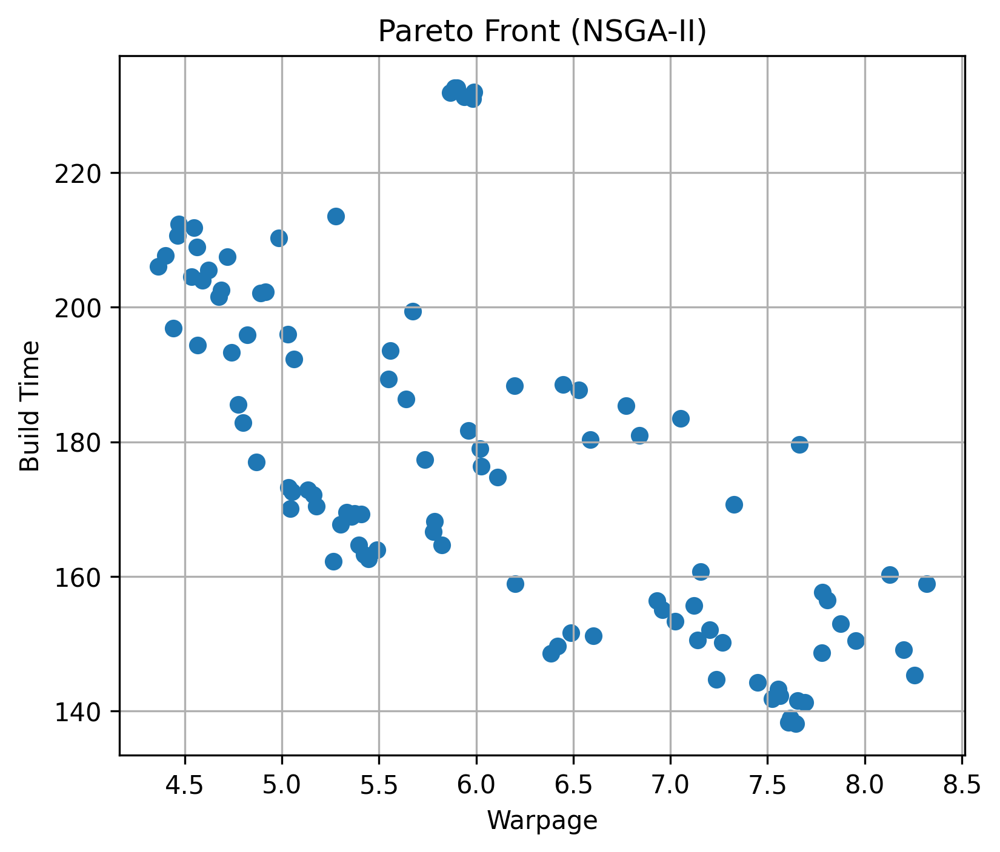
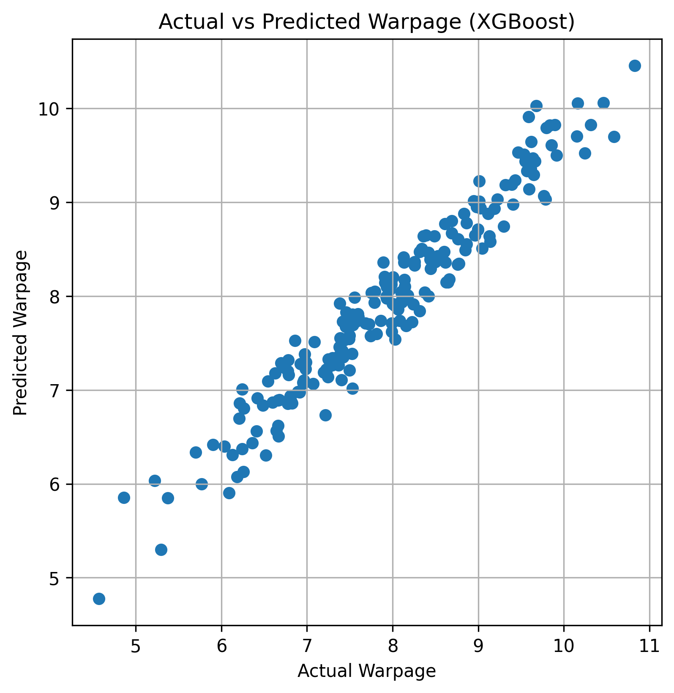
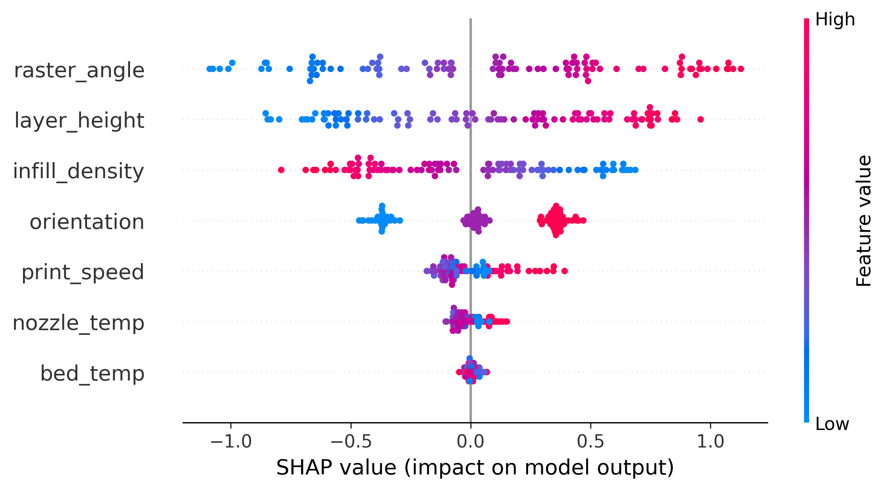

# Machine Learning-Driven Multi-Objective Optimization of FDM 3D Printing

## Overview
This project presents a data-driven framework to optimize FDM 3D printing parameters using Machine Learning and NSGA-II optimization.

## Objectives
- Minimize warpage
- Reduce build time
- Reduce energy consumption
- Maximize print quality

## Results

### Pareto Front

### Model Prediction

### SHAP Analysis

